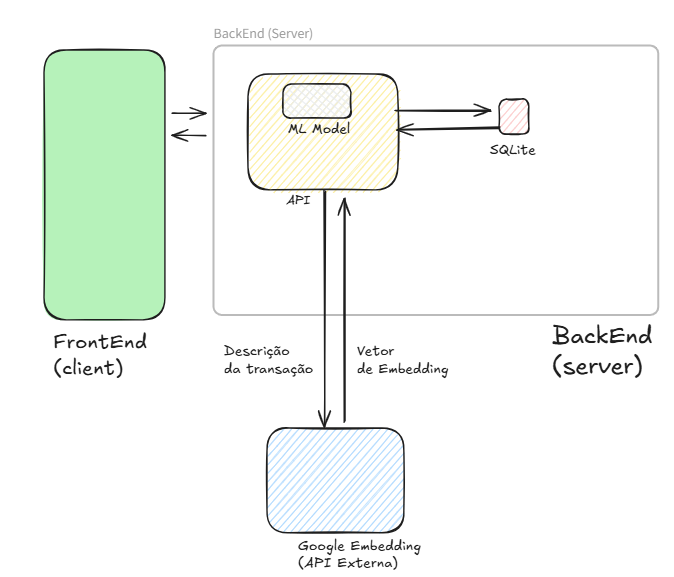
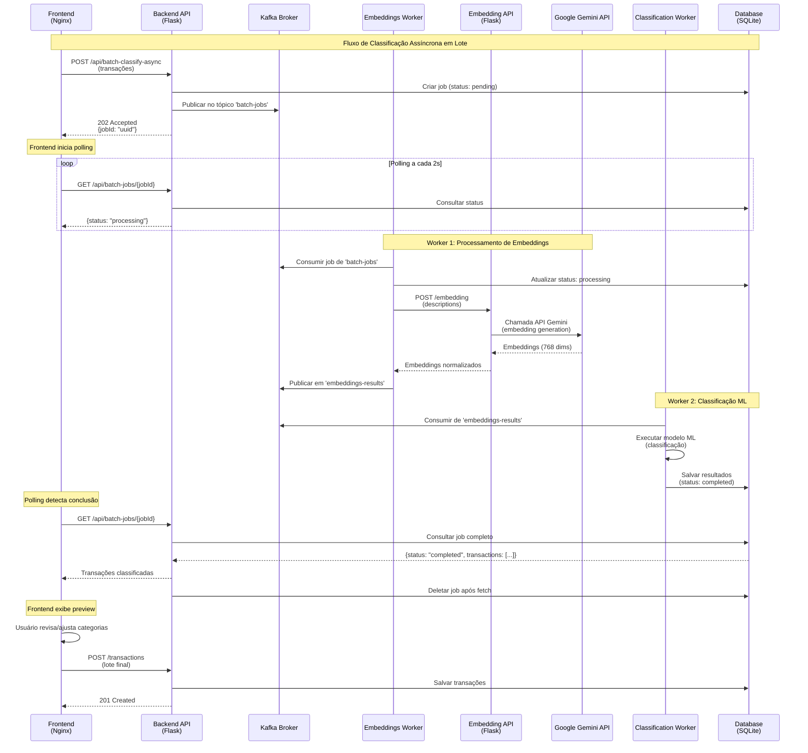

# Controle Financeiro - MVP Front-End
## Descrição do Projeto

Este é o repositório do **front-end** do projeto **Controle Financeiro**, desenvolvido como parte do MVP (Minimum Viable Product) para a Pós-Graduação em Engenharia de Software da PUC Rio. O objetivo do projeto é fornecer uma interface intuitiva e funcional para gerenciar finanças pessoais, permitindo o controle de transações, categorias e usuários de forma eficiente.

A aplicação foi construída utilizando **HTML**, **CSS**, **JavaScript** e **Bootstrap**, garantindo uma experiência responsiva e moderna para os usuários.

**Diferencial do Projeto**: A aplicação integra **Machine Learning** para classificação automática de transações financeiras. Através de um modelo de embeddings, o sistema sugere automaticamente categorias para despesas importadas, facilitando o gerenciamento financeiro e reduzindo o trabalho manual de categorização.
## Índice
- [Controle Financeiro - MVP Front-End](#controle-financeiro---mvp-front-end)
  - [Descrição do Projeto](#descrição-do-projeto)
  - [Índice](#índice)
  - [Arquitetura do Sistema](#arquitetura-do-sistema)
    - [Componentes do Sistema](#componentes-do-sistema)
    - [Estratégia de Comunicação](#estratégia-de-comunicação)
    - [API Externa Gemini](#api-externa-gemini)
    - [Fluxo de Classificação Automática (Assíncrono)](#fluxo-de-classificação-automática-assíncrono)
  - [Funcionalidades](#funcionalidades)
  - [Tecnologias Utilizadas](#tecnologias-utilizadas)
  - [🐳 Execução com Docker](#-execução-com-docker)
    - [Pré-requisitos Docker](#pré-requisitos-docker)
    - [Passo a Passo - Execução Docker](#passo-a-passo---execução-docker)
      - [1. Clone APENAS o Repositório Front-End](#1-clone-apenas-o-repositório-front-end)
      - [2. Configure as Variáveis de Ambiente](#2-configure-as-variáveis-de-ambiente)
      - [3. Inicie a Aplicação](#3-inicie-a-aplicação)
      - [4. Acesse a Aplicação](#4-acesse-a-aplicação)
      - [6. Ferramentas de Monitoramento](#6-ferramentas-de-monitoramento)
    - [Volumes Persistentes](#volumes-persistentes)
    - [Usuários WSL2](#usuários-wsl2)
  - [Formato do Arquivo de Importação](#formato-do-arquivo-de-importação)
    - [Exemplo de Template Excel](#exemplo-de-template-excel)
  - [Organização do Projeto](#organização-do-projeto)
    - [Estrutura de Arquivos](#estrutura-de-arquivos)
    - [Descrição dos Arquivos](#descrição-dos-arquivos)
  - [Endpoints da API](#endpoints-da-api)
    - [Transações](#transações)
    - [Usuários](#usuários)
    - [Categorias](#categorias)
    - [Tipos de Transação](#tipos-de-transação)
  - [Fluxo de Uso](#fluxo-de-uso)
    - [1. Importar Transações](#1-importar-transações)


## Arquitetura do Sistema

Este projeto utiliza uma arquitetura de **microserviços distribuídos** com processamento assíncrono via Kafka:



### Componentes do Sistema

1. **Frontend (Nginx)**: Interface web que permite aos usuários gerenciar suas finanças, importar transações e visualizar dados. Comunicação via API REST com o backend.

2. **[Backend API](https://github.com/GuilhermePFM/mvp-api)** (Flask):
   - Gerencia a lógica de negócio
   - Armazena dados de usuários, transações, categorias e tipos
   - Orquestra jobs de classificação via Kafka
   - Fornece endpoints REST para o front-end

3. **[Embedding API](https://github.com/GuilhermePFM/mvp-embedding)** (Flask): Microserviço especializado que:
   - Calcula embeddings (representações vetoriais) das descrições de transações
   - Integra com a API do Google Gemini
   - API key foi informada na plataforma do MVP

4. **Kafka Broker**: Message broker para processamento assíncrono de jobs de classificação em lote. Possui dois tópicos: 
   1. batch-jobs: armazena um pedido de classificação
   2. embeddings-results: armazena o resultado de um embedding

5. **Embeddings Worker**: Worker Kafka que consome do `batch-jobs`, solicita embeddings para Embedding API e publica resultados no tópico `embeddings-results`

6. **Classification Worker**: Worker Kafka que consome de `embeddings-results`, classifica transações usando o modelo ML e salva na base de dados

7. **Kafka Topics Init**: Container de inicialização que cria os tópicos necessários (`batch-jobs`, `embeddings-results`).

### Estratégia de Comunicação

O sistema utiliza uma **arquitetura híbrida** combinando comunicação **síncrona** (REST) e **assíncrona** (Kafka) para otimizar performance e escalabilidade:

**Comunicação Síncrona (REST):**
- Frontend ↔ Backend API: Operações CRUD, consultas imediatas e polling de status
- Embeddings Worker ↔ Embedding API: Geração de embeddings sob demanda
- Embedding API ↔ Google Gemini: Chamadas à API externa

**Comunicação Assíncrona (Kafka):**
- Backend API → Kafka: Publicação de jobs de classificação em lote
- Kafka → Workers: Distribuição de carga entre múltiplos workers
- Workers → Kafka: Publicação de resultados intermediários

**Benefícios desta estratégia:**
- **Desacoplamento**: Frontend não precisa aguardar processamento pesado
- **Escalabilidade**: Workers podem ser escalados horizontalmente via Kafka consumer groups
- **Resiliência**: Falhas temporárias são tratadas com retry automático nos workers
- **Performance**: Processamento paralelo de múltiplos jobs simultaneamente



**Padrões de Comunicação:**

1. **Request-Response Síncrono**: Para operações rápidas (CRUD, consultas simples)
2. **Fire-and-Forget Assíncrono**: Para processamento pesado (classificação em lote)
3. **Polling Pattern**: Frontend consulta status periodicamente até conclusão
4. **Message Queue Pattern**: Kafka desacopla produtores e consumidores
5. **Worker Pattern**: Processamento distribuído em múltiplos workers especializados

### API Externa Gemini

O sistema utiliza a **API de Embeddings do Google Gemini** para gerar representações vetoriais semânticas das descrições de transações financeiras. Esses embeddings são fundamentais para a classificação automática de transações usando Machine Learning.

**Sobre Embeddings:**
- Embeddings são representações numéricas de texto que capturam significado semântico
- Permitem que modelos ML compreendam similaridade entre textos mesmo com palavras diferentes
- Mais eficazes que abordagens baseadas apenas em palavras-chave

**Configuração do Gemini:**
- **Modelo**: `gemini-embedding-001` - Modelo otimizado para embeddings de texto
- **Dimensionalidade**: 768 dimensões (recomendação do Google para este modelo)
- **Tipo de Tarefa**: `CLASSIFICATION` - Otimizado especificamente para tarefas de categorização
- **Normalização**: Embeddings são normalizados para comprimento unitário (norma L2 = 1.0)

**Como funciona no sistema:**
1. O **Embeddings Worker** consome jobs do Kafka contendo descrições de transações
2. Worker chama a **Embedding API** (microserviço interno) via `POST /embedding`
3. Embedding API faz requisição REST para `https://generativelanguage.googleapis.com/v1beta/{model}:embedContent`
4. Google Gemini retorna vetores de 768 dimensões para cada descrição
5. Embeddings são normalizados e retornados ao worker
6. Classification Worker utiliza esses embeddings para classificar transações usando modelo ML treinado

**Referências:**
- [Documentação Oficial - Embeddings REST API](https://ai.google.dev/gemini-api/docs/embeddings#rest)
- [Cookbook - Quickstart de Embeddings](https://github.com/google-gemini/cookbook/blob/main/quickstarts/Embeddings.ipynb)


### Fluxo de Classificação Automática (Assíncrono)

```
1. Usuário faz upload de arquivo Excel com transações
   ↓
2. Frontend POST /api/batch-classify-async → Backend (retorna jobId)
   ↓
3. Backend publica job no tópico Kafka 'batch-jobs'
   ↓
4. Embeddings Worker consome o job
   ↓
5. Worker chama Embedding API → Google Gemini
   ↓
6. Worker publica resultados no tópico 'embeddings-results'
   ↓
7. Classification Worker consome os resultados
   ↓
8. Worker classifica usando modelo ML e armazena na base de dados
   ↓
9. Frontend faz polling GET /api/batch-jobs/{jobId} a cada 2 segundos
   ↓
10. Quando status='completed', exibe transações classificadas
   ↓
11. Usuário revisa/ajusta categorias sugeridas
   ↓
12. Usuário confirma → POST /transactions salva no banco de dados
```

## Funcionalidades

- ✅ **Criação de Transações Individuais**: Registre transações manualmente uma por vez
- ✅ **Importação em Lote via Excel**: Importe múltiplas transações de uma vez através de arquivos Excel (.xlsx)
- ✅ **Classificação Automática com Machine Learning**: O sistema sugere automaticamente categorias para as transações importadas usando embeddings
- ✅ **Gerenciamento de Categorias**: Crie categorias personalizadas para organizar suas despesas e receitas
- ✅ **Tipos de Transações**: Diferencie entre receitas, despesas e outros tipos de movimentações
- ✅ **Preview antes de Importar**: Revise e ajuste as classificações sugeridas antes de salvar definitivamente

## Tecnologias Utilizadas

- **HTML5**: Estrutura semântica da aplicação
- **CSS3**: Estilização personalizada da interface
- **JavaScript (ES6+)**: Lógica de front-end e manipulação do DOM
- **Bootstrap 5.2.3**: Framework CSS para design responsivo e componentes UI
- **jQuery 3.7.1**: Biblioteca JavaScript para manipulação simplificada do DOM
- **SheetJS (XLSX 0.18.5)**: Biblioteca para parsing e processamento de arquivos Excel
- **Fetch API**: Comunicação assíncrona com o backend

## 🐳 Execução com Docker

### Pré-requisitos Docker

- [Docker](https://www.docker.com/get-started) instalado (versão 20.10+)
- [Docker Compose](https://docs.docker.com/compose/install/) instalado (geralmente vem com Docker Desktop)

### Passo a Passo - Execução Docker
O projeto utiliza um sistema inteligente de cache busting baseado em git hash. Os scripts de build apenas recompilam serviços quando seus repositórios remotos têm novos commits.

**Build de todos os serviços:**

```bash
./build.sh  # Só reconstrói se os repositórios remotos mudaram
```

**Build de serviço específico:**

```bash
./build-backend.sh      # Somente mudanças no mvp-api
./build-embedding.sh    # Somente mudanças no mvp-embedding
```
#### 1. Clone APENAS o Repositório Front-End

```bash
git clone https://github.com/GuilhermePFM/mvp-front-end.git
cd mvp-front-end
```

> **Nota**: Você **não precisa** clonar os repositórios backend e embedding. O Docker fará isso automaticamente!

#### 2. Configure as Variáveis de Ambiente

```bash
# Copie o arquivo de exemplo
cp env.example .env

# Edite o arquivo .env (use nano, vim, notepad, VSCode, etc.)
nano .env
```

**Preencha as seguintes variáveis no arquivo `.env`**:

```env
GEMINI_API_KEY=enviada na plataforma do MVP
ENC_KEY=enviada na plataforma do MVP

## Backend
# Kafka Configuration
KAFKA_BROKER_ADDRESS=localhost:9092
BATCH_JOBS_TOPIC=batch-jobs
EMBEDDINGS_RESULTS_TOPIC=embeddings-results
EMBEDDINGS_CONSUMER_GROUP=embeddings_worker
CLASSIFICATION_CONSUMER_GROUP=classification_worker

# External Embedding API
EMBEDDING_API_URL=http://embedding-api:5001

# Docker BuildKit configuration (recommended for faster builds)
# Enables pip cache persistence between builds (10-50x faster after first build)
DOCKER_BUILDKIT=1
COMPOSE_DOCKER_CLI_BUILD=1
```

#### 3. Inicie a Aplicação

```bash
# Recomendado: Startup interativo com monitoramento
./start.sh
```

**O que acontece durante o startup**:
1. ⬇️ Docker clona os repositórios backend e embedding do GitHub (primeira vez)
2. 📦 Instala todas as dependências Python necessárias (primeira vez)
3. 🚀 Inicia os 7 serviços em ordem de dependência
4. ✅ Aguarda os healthchecks confirmarem que cada serviço está saudável
5. 📊 Script de monitoramento mostra progresso visual (se usar `./start.sh`)

**Tempo estimado**: 
- Primeira execução com build: 5-10 minutos
- Startups subsequentes: 60-90 segundos (aguardando health checks)

#### 4. Acesse a Aplicação

Após a inicialização completa, acesse:

- **Frontend**: [http://localhost:8080](http://localhost:8080) - Interface principal
- **Backend API**: [http://localhost:5000](http://localhost:5000) - Documentação Swagger
- **Embedding API**: [http://localhost:5001](http://localhost:5001) - Documentação OpenAPI


#### 6. Ferramentas de Monitoramento

**Monitor de progresso do startup:**

```bash
./startup-monitor.sh  # Progresso visual da inicialização dos serviços
```

**Monitoramento contínuo de health:**

```bash
./monitor-health.sh [intervalo_em_segundos]
```

**Diagnóstico do broker Kafka:**

```bash
./diagnose-broker.sh  # Execute se o broker mostrar unhealthy
```


### Volumes Persistentes

O Docker Compose cria volumes para persistir dados:

- `finance-backend-db`: Banco de dados SQLite (transações, usuários, categorias)
- `finance-backend-logs`: Logs da aplicação

**Dados são mantidos entre restarts**, a menos que você execute `docker-compose down -v`.

### Usuários WSL2

1. **Aloque recursos adequados** no `.wslconfig`:

Minha configuração WSL:
```ini
[wsl2]
networkingMode=mirrored
memory=6GB   # Limits VM memory in WSL 2 up to 6GB
processors=4 # Makes the WSL 2 VM use 4 virtual processors
```

---

## Formato do Arquivo de Importação

*O template é disponibilizado neste repositório (front-end)* 

Para utilizar a funcionalidade de importação em lote, seu arquivo Excel (.xlsx) deve seguir o formato específico:

### Exemplo de Template Excel

| Data       | Descrição                    | Valor     | Pessoa |
|------------|------------------------------|-----------|--------|
| 2024-01-15 | Supermercado Extra          | 250,50    | João  | 
| 2024-01-16 | Posto de Gasolina          | 180,00    | Maria |
| 2024-01-17 | Netflix Assinatura         | 39,90     | João |

**Especificações das Colunas:**

1. **Data**: Formato `YYYY-MM-DD` ou `DD/MM/YYYY`
2. **Descrição**: Texto descritivo da transação (usado pelo ML para classificação)
3. **Valor**: Valor numérico no formato brasileiro (ex: `1.250,50`) ou internacional (ex: `1250.50`)
4. **Pessoa**: Nome do membro da família responsável pela transação
5. **Categoria**: Categoria da transação (pode ficar em branco para classificação automática)

**Observações:**
- O arquivo deve conter um cabeçalho com os nomes exatos das colunas
- Valores em branco na coluna "Categoria" serão preenchidos automaticamente pelo sistema ML

## Organização do Projeto

O projeto está organizado em uma estrutura de arquivos e pastas que facilita o desenvolvimento e a manutenção do código.

### Estrutura de Arquivos
```plaintext ****
mvp-front-end/
├── index.html                  # Arquivo principal da aplicação (estrutura HTML)
├── styles.css                  # Arquivo de estilos personalizados (CSS)
├── batch_import.js             # Script para importação em lote e classificação ML
├── async_classification.js    # Função para enviar batch para classificação assíncrona
├── polling.js                  # Função para polling do status do job de classificação
├── transactions.js             # Script para gerenciar transações e categorias
├── transaction_types.js        # Script para gerenciar tipos de transações
├── transaction_validation.js   # Script para validação de transações
├── category.js                 # Script para gerenciar categorias
├── user.js                     # Script para gerenciar usuários/família
├── utils.js                    # Script com funções utilitárias
├── img/                        # Pasta para imagens e recursos visuais
└── README.md                   # Documentação do projeto
```

### Descrição dos Arquivos

- **`index.html`**:
  - Arquivo principal que define a estrutura da interface do usuário
  - Contém os elementos HTML para navbar, tabelas, modais e botões
  - Inclui modais para: criação de transações, importação em lote, gerenciamento de usuários e categorias

- **`styles.css`**:
  - Arquivo de estilos personalizados para a aplicação
  - Define o design visual: cores, fontes, espaçamentos e estilos de componentes
  - Complementa os estilos do Bootstrap com customizações específicas

- **`async_classification.js`**:
  - Função `sendBatchForClassification()` que envia transações para classificação assíncrona
  - Faz POST para `/api/batch-classify-async` e retorna jobId
  - Utilizado por `batch_import.js` para iniciar o processo de classificação

- **`polling.js`**:
  - Função `pollJobStatus()` que consulta o status do job de classificação
  - Faz polling GET `/api/batch-jobs/{jobId}` a cada 2 segundos até completar
  - Retorna transações classificadas quando status='completed'
  - Utilizado por `batch_import.js` para acompanhar o progresso

- **`batch_import.js`** ⭐:
  - **Funcionalidade principal do projeto**
  - Orquestra o fluxo completo de importação em lote
  - Parse de arquivos Excel (.xlsx) usando a biblioteca SheetJS
  - Validação de formato e estrutura dos dados importados
  - Utiliza `sendBatchForClassification()` (async_classification.js) para submeter job
  - Utiliza `pollJobStatus()` (polling.js) para acompanhar progresso
  - Exibição de preview interativo com dropdowns para revisão de categorias
  - Formatação de valores monetários e datas
  - Envio de lote de transações para o backend (`POST /transactions`)

- **`transactions.js`**:
  - Script responsável por gerenciar transações financeiras
  - Funções para listar, adicionar e formatar transações
  - Cálculo automático de totais
  - Formatação de valores em moeda brasileira (BRL)
  - Atualização dinâmica da tabela de transações

- **`transaction_types.js`**:
  - Script responsável por gerenciar os tipos de transações
  - Lista tipos disponíveis (receita, despesa, transferência, etc.)
  - Popula dropdown de seleção de tipos

- **`category.js`**:
  - Script responsável por gerenciar as categorias de transações
  - Funcionalidades para criar, listar e manipular categorias
  - Popula dropdowns de categorias nos formulários

- **`user.js`**:
  - Script responsável por gerenciar usuários/membros da família
  - Funções para listar, criar e manipular usuários
  - Modal de gerenciamento de família
  - Popula dropdowns de seleção de usuários

- **`transaction_validation.js`**:
  - Script responsável por validar os dados das transações
  - Garante que os dados inseridos estejam corretos e completos

- **`utils.js`**:
  - Script com funções utilitárias reutilizáveis
  - Tratamento de erros de API
  - Criação dinâmica de elementos HTML (dropdowns, componentes)
  - Funções auxiliares para formatação e manipulação de dados

- **`README.md`**:
  - Arquivo de documentação do projeto
  - Contém informações sobre objetivo, arquitetura, organização e instruções

## Endpoints da API

A aplicação front-end consome os seguintes endpoints do backend:

### Transações
- `GET /transactions` - Lista todas as transações
- `POST /transaction` - Cria uma nova transação individual
- `POST /transactions` - Importa múltiplas transações em lote
- `POST /api/batch-classify-async` - Submete job de classificação em lote (retorna jobId)
- `GET /api/batch-jobs/{jobId}` - Consulta status do job (retorna 'processing'/'completed'/'failed')

**Fluxo de Classificação em Lote (Assíncrono):**
1. POST transações para `/api/batch-classify-async` → recebe `{jobId}`
2. Poll GET `/api/batch-jobs/{jobId}` a cada 2 segundos
3. Quando `status: "completed"`, recupera transações classificadas da resposta
4. Frontend trata isso automaticamente - veja [ASYNC_IMPLEMENTATION.md](ASYNC_IMPLEMENTATION.md)

### Usuários
- `GET /users` - Lista todos os usuários/membros da família
- `POST /user` - Cria um novo usuário

### Categorias
- `GET /transaction_categories` - Lista todas as categorias
- `POST /transaction_category` - Cria uma nova categoria

### Tipos de Transação
- `GET /transaction_types` - Lista todos os tipos de transação disponíveis

**URL Base Padrão**: `http://127.0.0.1:5000`

## Fluxo de Uso


### 1. Importar Transações 

**Com Classificação Automática ML:**
1. Prepare um arquivo Excel seguindo o [formato especificado](#formato-do-arquivo-de-importação)
2. Clique no botão "Importe Transações"
3. Selecione seu arquivo Excel (.xlsx)
4. Aguarde o processamento e classificação automática (pode levar alguns segundos)
5. Revise as categorias sugeridas pelo sistema ML
6. Ajuste manualmente as categorias, se necessário
7. Selecione as pessoas responsáveis por cada transação
8. Clique em "Importar" para salvar definitivamente

**Este projeto foi desenvolvido como MVP para a Pós-Graduação em Engenharia de Software da PUC Rio.**

---